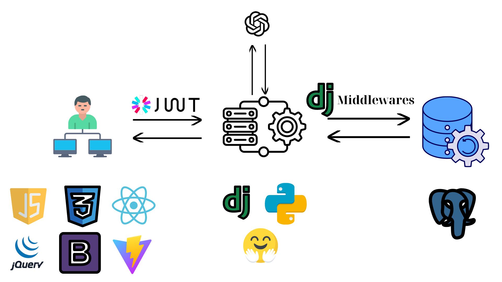

# AI Project: Apply LSTM and RAG with LLM into Robo Stock Autovisor

This project is a fullstack web product primarily programmed in Python and JavaScript. The project consists of two parts: the frontend is developed using React + Vite.js, and the backend is developed using the Django framework. Some additional technologies are clearly displayed in the diagram as described.
## install
### Clone repo into your space
```
git clone https://github.com/dinhtanloc/AI_project_final.git
code AI_project_final
```
### Frontend
```
cd frontend
npm i
```

### Backend
```
cd backend
pip install -r requirements.txt

```

## quick start
You can start the application immediately by following these instructions.
Prepare the .env file for both the frontend and backend with the content as described below.
```
// frontend/.env

VITE_DOMAIN_BACKEND = http://127.0.0.1:8000
VITE_FACEBOOK= 'Link to facebook'
VITE_LINKEDIN= 'Link to LinkedIn'

```

```
// backend/.env
// Info your DBMS
DB_name= 'name database'
DB_user= 'PostgreSQL user'
DB_password= 'Your password'
DB_port= 'PORT'
AI_key =  'OPEN AI keys' //Info your OPENAI keys accounts
DJANGO_keys = 'Django project keys'

```

In the terminal, navigate to the root directory of the project and enter the following commands.

```
cd frontend

// ./frontend
npm run dev


// Your web backend domain is http://localhost:5173
cd backend

// ./backend
python manage.py migrate
python manage.py makemigrations
python manage.py migrate
python manage.py runserver //start backend

// Your web backend domain is http://localhost:8000
// If you want to create admin account to login Django backend admin template, you can use these syntax:
python manage.py makemigrations
// Input your infomation and follow instrucstion
// After you create admin accounts, you can login at http://localhost:8000/admin
```

## Reference
1. [Loc Dinh CarRetail Web](https://github.com/dinhtanloc/hw_web_development/tree/main)
2. [Langchain document](https://www.langchain.com/)
3. [Langchain repository](https://github.com/langchain-ai/langchain)
4. [Rest API for Django](https://github.com/encode/django-rest-framework)
5. [MVP AI project](https://github.com/dinhtanloc/Stock-forecast-app-streamlit)


